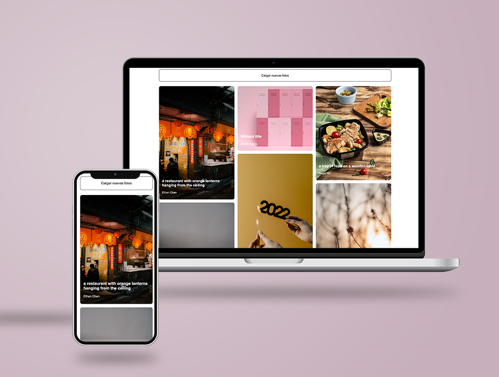

# 📷 Unsplash gallery

An application where Unsplash images are viewed using the Unsplash API and replicating the design given in figma.

## Screenshots



<br>

---

<br>

## Table of contents

- [My process](#my-process)
  - [Why this project?](#why-this-project)
  - [Structure](#structure)
  - [Built with](#built-with)
  - [API reference](#api-reference)
  - [What happens on the web?](#what-happens-on-the-web)
  - [What I learned](#what-i-learned)
- [Further implementations](#further-implementations)
- [Links](#links)
- [How can you run this project](#how-can-you-run-this-project)
- [Author](#author)
- [Support](#support)

<br>

---

<br>

## MY PROCESS

### Why this project?

I had never designed a masonry layout before and was interested to see if I could do it with a few lines of code (spoiler: yes, I can 😜).

<br>

### Structure

```bash
.
├── README.md
├── node_modules
├── package-lock.json
├── package.json
├── public
│   ├── favicon.ico
│   └── index.html
└── src
    ├── assets
    ├── components
    ├── index.js
    ├── setupTests.js
    └── stylesheets
```

<br>

### Built with

- [VSC](https://code.visualstudio.com/)
- [npm](https://www.npmjs.com/) Version 6.14.12
- [HTML5](https://developer.mozilla.org/en-US/docs/Web/HTML)
- [CSS3](https://developer.mozilla.org/es/docs/Web/CSS)
- [Sass](https://sass-lang.com/) Version 1.58.0
- [React 18](https://es.reactjs.org/)
- [Unsplash API](https://unsplash.com/developers)

<br>

### API Reference

This project is created by working with the Unsplash API.

You can find all the API information and documentation here: https://unsplash.com/documentation

All API requests require the use of a generated API key, so to run the project you will need your own API key and you can generate this API key here: https://unsplash.com/join

| Parameter | Type     | Description                |
| :-------- | :------- | :------------------------- |
| `key`     | `string` | **Required**. Your API key |

Due I needed list of pictures and its information I worked with the next **endpoint**:

[**List photos**](https://unsplash.com/documentation#list-photos)

```http
GET /photos
```

**Responses**

```bash
[
  {
    "id": "LBI7cgq3pbM",
    "created_at": "2016-05-03T11:00:28-04:00",
    "updated_at": "2016-07-10T11:00:01-05:00",
    "width": 5245,
    "height": 3497,
    "color": "#60544D",
    "blur_hash": "LoC%a7IoIVxZ_NM|M{s:%hRjWAo0",
    "likes": 12,
    "liked_by_user": false,
    "description": "A man drinking a coffee.",
    "user": {
      "id": "pXhwzz1JtQU",
      "username": "poorkane",
      "name": "Gilbert Kane",
      "portfolio_url": "https://theylooklikeeggsorsomething.com/",
      "bio": "XO",
      "location": "Way out there",
      "total_likes": 5,
      "total_photos": 74,
      "total_collections": 52,
      "instagram_username": "instantgrammer",
      "twitter_username": "crew",
      "profile_image": {
        "small": "https://images.unsplash.com/face-springmorning.jpg?q=80&fm=jpg&crop=faces&fit=crop&h=32&w=32",
        "medium": "https://images.unsplash.com/face-springmorning.jpg?q=80&fm=jpg&crop=faces&fit=crop&h=64&w=64",
        "large": "https://images.unsplash.com/face-springmorning.jpg?q=80&fm=jpg&crop=faces&fit=crop&h=128&w=128"
      },
      "links": {
        "self": "https://api.unsplash.com/users/poorkane",
        "html": "https://unsplash.com/poorkane",
        "photos": "https://api.unsplash.com/users/poorkane/photos",
        "likes": "https://api.unsplash.com/users/poorkane/likes",
        "portfolio": "https://api.unsplash.com/users/poorkane/portfolio"
      }
    },
    "current_user_collections":  // The *current user's* collections that this photo belongs to.
      {
        "id": 206,
        "title": "Makers: Cat and Ben",
        "published_at": "2016-01-12T18:16:09-05:00",
        "last_collected_at": "2016-06-02T13:10:03-04:00",
        "updated_at": "2016-07-10T11:00:01-05:00",
        "cover_photo": null,
        "user": null
      },
      // ... more collections
    ],
    "urls": {
      "raw": "https://images.unsplash.com/face-springmorning.jpg",
      "full": "https://images.unsplash.com/face-springmorning.jpg?q=75&fm=jpg",
      "regular": "https://images.unsplash.com/face-springmorning.jpg?q=75&fm=jpg&w=1080&fit=max",
      "small": "https://images.unsplash.com/face-springmorning.jpg?q=75&fm=jpg&w=400&fit=max",
      "thumb": "https://images.unsplash.com/face-springmorning.jpg?q=75&fm=jpg&w=200&fit=max"
    },
    "links": {
      "self": "https://api.unsplash.com/photos/LBI7cgq3pbM",
      "html": "https://unsplash.com/photos/LBI7cgq3pbM",
      "download": "https://unsplash.com/photos/LBI7cgq3pbM/download",
      "download_location": "https://api.unsplash.com/photos/LBI7cgq3pbM/download"
    }
  },
  // ... more photos
]
```

<br>

### What happens on the web?

- The first time the user enters the website, the API will be "called" and it will return 13 images, as this is how I have configured the endpoint.

- When the user clicks on the "Cargar más fotos" button, the randomPage() function is called, which will generate a random number that will be the new page number where the API will take us in this new call that we are also activating when clicking.

<br>

### What I learned

- I discovered this challenge two days before the deadline so I had to create it in a few hours when I got back from work.

- I focused on the end goal, I tried to replicate the design as much as I could.

- Being aware that you can't achieve everything and being calm with the decision has been the biggest learning from this project.

<br>

---

<br>

## Further implementations

- Click a picture and open it in raw format in a new tab
- Change the text color depending on the image color
- Apply testing
- Refactor
- Atomise

<br>

---

<br>

## Links

- Code: [https://github.dev/albavidalm/unsplash-gallery](https://github.dev/albavidalm/unsplash-gallery)
- Live: [https://albavidalm.github.io/unsplash-gallery](https://albavidalm.github.io/unsplash-gallery)

<br>

---

<br>

### How can you run this project

This project was bootstrapped with [Create React App](https://github.com/facebook/create-react-app).

- Once you've download or cloned the project, install it with:

  ```bash
  npm install
  ```

- After that, if you want to run it in local execute this command:
  ```bash
  npm start
  ```

<br>

---

<br>

## Author

[](mailto:albavidalm@gmail.com?subject=Hi)
[](https://www.linkedin.com/in/albavidalm//)
[](https://twitter.com/albavidal_m)
[](https://github.com/albavidalm)

<br>

---

<br>

## Support 🖤

Sharing is caring, contributions, PR and suggestions are always welcome.
